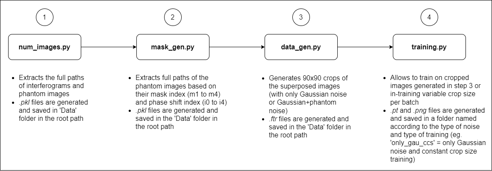

# Denoising TWI interferograms

\
**SETUP:**

1. Python version: 3.6.9
2. pip3 version: 21.3.1
3. All the packages and their version requirements are listed in [_requirements.txt_](https://gitlab1.ptb.de/hoffma31/machine-learning/-/blob/master/requirements.txt). (To install all packages at once: `pip3 install -r requirements.txt`)

\
**DATASET INFO:**

1. There are two folders containing simulated interferogram images: **InterferogramML4** and **InterferogramML5**
2. There is only one folder containing  phantom images: **20201127_zero_images** (Note: set paths to all of these folders in the **num_img** method of [_path_file.py_](https://gitlab1.ptb.de/hoffma31/machine-learning/-/blob/master/path_file.py))

\
**DATA GENERATION:**
1. Assign full path to the folder where the interferogram image path files and phantom image path files are stored in the **num_img** method of [_path_file.py_](https://gitlab1.ptb.de/hoffma31/machine-learning/-/blob/master/path_file.py)
2. Assign full path of these folders to the variables **infs_path_1**, **infs_path_2**, and **emp_infs_path** resp. in the **num_img** method of [_path_file.py_](https://gitlab1.ptb.de/hoffma31/machine-learning/-/blob/master/path_file.py)
3. Assign variables in the **d_gen** method of [_path_file.py_](https://gitlab1.ptb.de/hoffma31/machine-learning/-/blob/master/path_file.py) to generate Gaussian noise superpositions or Gaussian + phantom noise superpositions
4. Set the hyperparameters in the **training_vcs_hyperparams** method of [_training_utils.py_](https://gitlab1.ptb.de/hoffma31/machine-learning/-/blob/master/training_utils.py)
5. Set crop_size variable in [_data_gen_fin.py_](https://gitlab1.ptb.de/hoffma31/machine-learning/-/blob/master/training_utils.py) to define the training examples crop size

**MODEL TRAINING (FOLLOW THE FLOW CHART BELOW FOR TRAINING A MODEL):**

[_training_utils.py_](https://gitlab1.ptb.de/hoffma31/machine-learning/-/blob/master/training_utils.py) classes and methods:
1. **Constant_crop_dataset** class = Custom dataset class for the 90x90 crops generated by [_data_gen_fin.py_](https://gitlab1.ptb.de/hoffma31/machine-learning/-/blob/master/training_utils.py)
2. **Variable_crop_dataset** class = Custom dataset class for generating in-training noisy (superposed) images
3. **training_type** method = Type of training images (constant crop size per batch or variable crop size per batch), type of noise (Gaussian noise or Gaussian+phantom noise), use of single GPU or multiple GPUs
4. **gen_hyperparams** method = General training hyperparamteres
5. **training_vcs_hyperparams** method = Hyperparameters specific to variable crop size per batch training
6. **training_ccs_hyperparams** method = Hyperparameters specific to constant crop size per batch training
7. **ratio_computation** method = Ratio of outpur noise to input noise computation during training and validation
8. **training_ccs** method = Constant crop size per batch training
9. **validation_ccs** method = Constant crop size per batch validation
10. **training_vcs** method = Variable crop size per batch training
11. **validation_vcs** method = Variable crop size per batch validation
12. **plots** method = Loss plot and ratio plot

\
**EXPLAINABILITY METHODS**\
[_xai_utils.py_](https://gitlab1.ptb.de/hoffma31/machine-learning/-/blob/master/XAi/xai_utils.py) classes and methods:

1. **paths** method = FixedInterferograms path, .pkl files path, and saved model path
2. **hyperparams** method = General hyperparamters
3. **XAi_dataset** class = Custom dataset class for generating in-training noisy (superposed) images
4. **create_dirs** method = Folders for saving heatmaps, model input (noisy), model output, clean interferogram
5. **Guided_backprop** class = Guided backpropagation (GBP) explainability method
6. **normalize** method = Image normalization to make image mean=0 and image standard deviation=1
7. **sensitivity_analysis** method = Vanilla gradients explainability method, and heatmaps (greyscale and colored heatmaps)
8. **gbp_heatmaps** method = GBP greyscale heatmaps and colored heatmaps 

\
**TESTING**\
[_testing_utils.py_](https://gitlab1.ptb.de/hoffma31/machine-learning/-/blob/master/testing/testing_utils.py) classes and methods:
1. **params** method = Parameters for testing
2. **Superposition_test** class = Custom dataset class for generating testing noisy (superposed) images
3. **recons_save_image** method = Save an image in 8-bit format
4. **testing_proc** method =  Test the model on testing inputs that are not exposed during training

[_testing_metrics.py_](https://gitlab1.ptb.de/hoffma31/machine-learning/-/blob/master/testing/testing_metrics.py) classes and methods:

1. **com_phase_p** method = Phase image computation from 5 clean interferograms
2. **com_phase_tilde_p** method = Phase image computation from 5 denoised interferograms
3. **SSIM** method = SSIM metric for the interferograms
4. **SSIM_phase** method = SSIM metric for the phase images
5. **diff** method = Difference image computation for the interferogram
6. **diff_phase** method = Difference image computation for the phase images 
7. **RMSD** method = RMSD metric for the difference images of the interferograms
8. **RMSD_phase** method = RMSD metric for the difference images of the phase images
9. **RMSD_ratio** method = Ratio computation of the rmsd metric computed for the interferograms
10. **RMSD_ratio_phase** method = Ratio computation of the rmsd metric computed for the phase images
11. **SSIM_ratio** method = Ratio computation of the ssim metric computed for the interferograms
12. **SSIM_ratio_phase** method = Ratio computation of the ssim metric computed for the phase images

\
**TESTING MEASUREMENT DATA:**\
[_testing_mea_utils.py_](https://gitlab1.ptb.de/hoffma31/machine-learning/-/blob/master/testing_MEA/testing_mea_utils.py) classes and methods:

1. **paths** method: Returns measurement data and corresponding masks paths 
2. **dirs** method: Creates directories for saving input and output of the model
3. **Masking** class: Masking the measurement data (setting background pixels to 0) using masks 
4. **remove_module** method: Removes 'module.' from model paramereters' name

\
**BM3D:**\
[_bm3d_utils.py_](https://gitlab1.ptb.de/hoffma31/machine-learning/-/blob/master/BM3D/bm3d_utils.py) methods:

1. **paths** method: Returns path of clean interferograms and deep learning denoised interferograms
2. **noise_level** method: Returns the standard deviation of the Gaussian to produce noisy image from clean image
3. **dirs_files_bm3d** method: Creates all the required files and directories to store BM3D results
4. **dirs_files_dl** method: Creates all the required files and directories to store DL results
5. **PSNR** method: PSNR computation between the given two inputs
6. **compute_psnr** method: Calls the **PSNR** method to compute the PSNR and stores it 
7. **psnr_mean** method: Mean PSNR computation of all the examples
